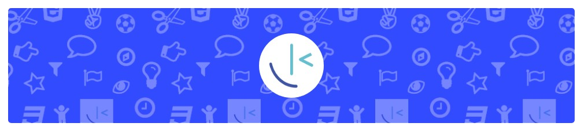

# Frontend Mentor - Bookmark landing page

## Welcome! 👋

## Table of contents

- [Overview](#overview)
  - [The challenge](#the-challenge)
  - [Screenshot](#screenshot)
  - [Links](#links)
- [My process](#my-process)
  - [Built with](#built-with)
  - [What I learned](#what-i-learned)
  - [Continued development](#continued-development)
  - [Useful resources](#useful-resources)
- [Author](#author)
- [Acknowledgments](#acknowledgments)

## The challenger

## Screenshot
<!-- 

 -->

## Links

[Source Text](https://en.wikisource.org/wiki/Natural_History_Review/Series_2/Volume_1/Number_2/On_the_Affinities_of_the_Brain_of_the_Orang_Utang)